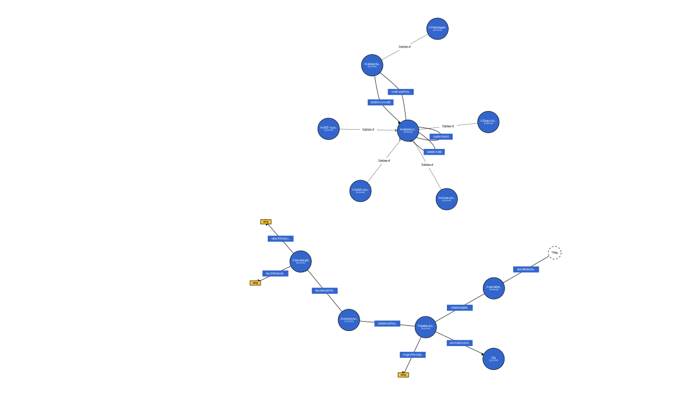

# py-mmut-rdf

A Python library providing RDF ontology definitions for MMUT (MicroModel and Transformations). This library contains a generated TTL (Turtle) file with MMUT ontology definitions and provides a convenient Python interface to access the ontology classes and properties.

## Ontology Visualization

Visualized the ontology with [WebVOWL](https://service.tib.eu/webvowl/)




## Installation
See: https://pypi.org/project/py_mmut_rdf/
```bash
pip install py-mmut-rdf
```

## Usage

```python
from py_mmut_rdf import MMUT
from rdflib import URIRef, Graph, RDF

g = Graph()
g.bind("mmut", MMUT._NS)
g.add((URIRef("http://example.org#model_x"), RDF.type, MMUT.RDFMicroModel))
```

### SHACL Validation in Python

```python
from importlib.resources import files
from pyshacl import validate
from rdflib import Graph

data_graph = Graph()
# data_graph.parse("path/to/your-model.ttl", format="turtle")

shapes_path = files("py_mmut_rdf").joinpath("mmut-shapes.ttl")
conforms, report_graph, report_text = validate(
	data_graph=data_graph,
	shacl_graph=str(shapes_path),
)

print(conforms)
print(report_text)
```

## SHACL Validation

The library includes SHACL shapes in [py_mmut_rdf/mmut-shapes.ttl](py_mmut_rdf/mmut-shapes.ttl).

Install pySHACL if needed:

```bash
pip install pyshacl
```

### 1. Loop Example (should fail)

```bash
pyshacl -s py_mmut_rdf/mmut-shapes.ttl path/to/test-loop.ttl -f human
```

Expected result: `Conforms: False`

### 2. Real MMUT Example

```bash
pyshacl -s py_mmut_rdf/mmut-shapes.ttl path/to/mmut-squirrl.ttl -f human
```

Tip: add `-d` for verbose diagnostics.

## Development


### Regenerating the Ontology

If you need to recreate the TTL file:

```bash
python create_mmut_ontology.py
```


### Testing

Run the test script to verify everything works:

```bash
python -m pytest tests/
```
### Building the Package

```bash
poetry build
```

### Publish the Package
```bash
poetry publish --username __token__ --password <TOKEN>
```

### Versioning via Git Tags

The package version is derived automatically from Git tags during build/release.

Use semantic version tags, e.g.:

```bash
git tag v0.0.3
git push origin v0.0.3
```

In GitHub Actions, the workflow fetches tags and builds the package with the tag-derived version.

## Contributing

Pull requests are welcome. For major changes, please open an issue first to discuss what you would like to change.

Please make sure to update tests as appropriate.

## License

[MIT](https://choosealicense.com/licenses/mit/)